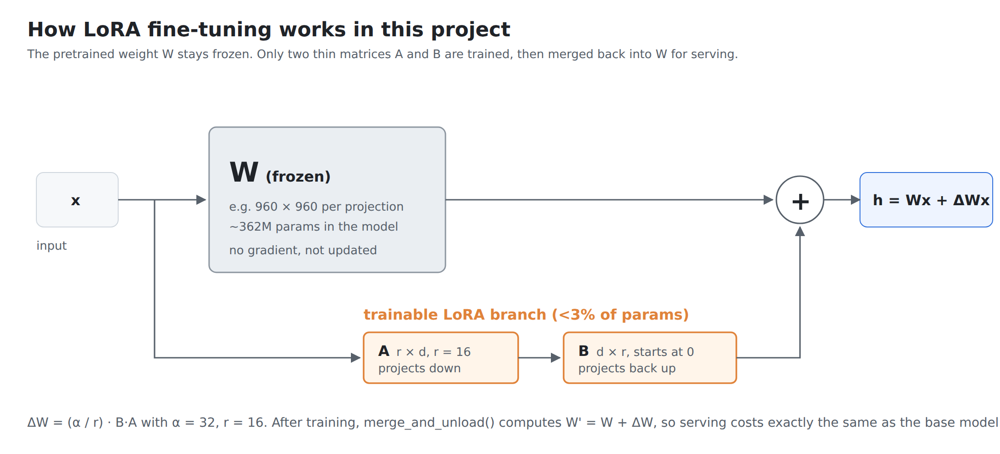
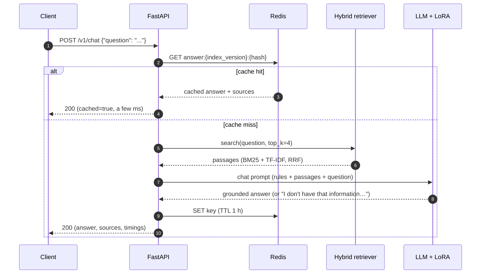
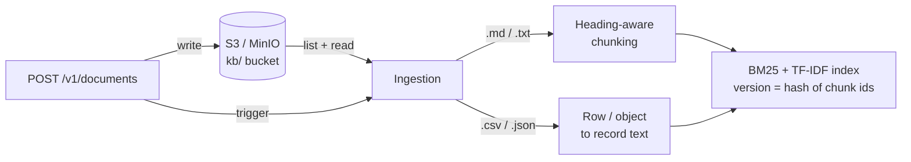

<div align="center">

# Containerized LLM Response API with Retrieval

**A LoRA fine-tuned open-source LLM served as a containerized REST API, answering workplace questions with retrieval-augmented generation (RAG) over structured and unstructured documents, with Redis caching and S3 document storage.**


> **Verification status:** the repository includes the training, evaluation, and load-test harnesses. Run them on your intended hardware and preserve the generated `results/` artifacts before publishing any numerical latency or hallucination claims.

</div>

---

## Table of Contents

1. [What is this project?](#1-what-is-this-project)
2. [Key results](#2-key-results)
3. [Screenshots](#3-screenshots)
4. [Concepts explained (a mini tutorial)](#4-concepts-explained-a-mini-tutorial)
5. [Architecture](#5-architecture)
6. [Project structure](#6-project-structure)
7. [Quick start](#7-quick-start)
8. [Step-by-step tutorial: build it from zero](#8-step-by-step-tutorial-build-it-from-zero)
9. [API reference](#9-api-reference)
10. [How the evaluation works](#10-how-the-evaluation-works)
11. [Configuration](#11-configuration)
12. [Testing and CI](#12-testing-and-ci)
13. [Design decisions and trade-offs](#13-design-decisions-and-trade-offs)
14. [Troubleshooting](#14-troubleshooting)
15. [Roadmap](#15-roadmap)
16. [Author](#16-author)
17. [License](#17-license)

---

## 1. What is this project?

Imagine a new employee asking an internal chatbot: *"How many PTO days do I get?"* or *"What's the hotel limit in New York?"*. A general-purpose LLM does not know your company's policies, so it either refuses or, worse, **confidently makes something up** (a *hallucination*).

This project builds a production-style service that fixes that:

| Piece | What it does | Where |
|---|---|---|
| **Open-source LLM** | [`SmolLM2-360M-Instruct`](https://huggingface.co/HuggingFaceTB/SmolLM2-360M-Instruct), small enough to run on a laptop CPU | `app/llm.py` |
| **LoRA fine-tuning** | Teaches the model to give short, friendly workplace answers, to use **only** the supplied context, and to say *"I don't have that information"* instead of guessing | `training/` |
| **Retrieval (RAG)** | Finds the relevant policy paragraphs and table rows for every question and puts them into the prompt | `app/retriever.py`, `app/ingest.py` |
| **Structured + unstructured sources** | Markdown policies *and* CSV/JSON tables (holidays, offices, team directory, benefits, IT SLAs) | `knowledge_base/` |
| **REST API** | FastAPI with JSON and streaming (Server-Sent Events) endpoints, Swagger docs, a small chat UI, Prometheus metrics | `app/main.py` |
| **Redis cache** | Repeated questions are answered from cache in milliseconds; cache keys include the index version so new documents invalidate old answers | `app/cache.py` |
| **AWS S3 storage** | The knowledge base lives in an S3 bucket (MinIO locally, AWS S3 in the cloud); upload new documents through the API | `app/storage.py` |
| **Docker** | One `docker compose up` starts the API, Redis and MinIO | `docker/`, `docker-compose.yml` |
| **Evaluation + load testing** | Held-out hallucination benchmark (base vs. LoRA, with and without RAG) and an async concurrent-user load test | `eval/`, `loadtest/` |

> **About the data:** the knowledge base describes **Lumen Robotics, a fictional company**. Every name, number and policy is invented, so the project can be shared publicly. The training data uses *other* fictional companies, so the evaluation measures real generalization, not memorization.

---

## 2. Key results

This project is set up to measure response latency, cache performance, grounded-answer accuracy, and hallucination rate. No precomputed benchmark figures are included in this public version, so every portfolio metric can be reproduced from tracked inputs and scripts.

---

## 3. Screenshots

<p align="center"></p>

<p align="center"></p>

---

## 4. Concepts explained (a mini tutorial)

New to LLM engineering? This section explains every building block used in the project, in plain language.

### 4.1 Large Language Models (LLMs)
An LLM predicts the next token (a word piece) given the previous tokens. An *instruct* or *chat* model has been further trained to follow instructions in a conversation format (`system`, `user`, `assistant` messages). We use **SmolLM2-360M-Instruct** (360 million parameters). Big models such as GPT-4-class models have hundreds of billions, but a small model is enough for short, grounded answers and runs on a CPU.

### 4.2 Fine-tuning and LoRA
*Fine-tuning* means continuing training on your own examples so the model adopts a behavior. Full fine-tuning updates every weight, which is slow and memory hungry. **LoRA (Low-Rank Adaptation)** freezes the original weights `W` and learns a small update `ΔW = B·A`, where `A` and `B` are thin matrices of rank `r`:

<p align="center"></p>

* Only the LoRA adapter matrices are trained, so training requires far less memory than full fine-tuning.
* The adapter file is a few MB, not a whole new model.
* After training, `merge_and_unload()` folds `ΔW` into `W`, so **inference costs exactly the same** as the base model.

What we teach the model (see `training/make_dataset.py`):

| Example type | Share | Teaches the model to… |
|---|---|---|
| Grounded answers | ~63% | answer in 1-2 sentences using the right passage among distractors (including table "record" chunks) |
| Unanswerable questions | ~24% | reply *"I don't have that information in the company documents."* when the context lacks the answer |
| Conversational requests | ~8% | help with everyday workplace messages (reschedule a 1:1, thank a teammate) |
| Company questions without context | ~5% | not invent company facts when retrieval is off |

### 4.3 Retrieval-Augmented Generation (RAG)
Instead of hoping the model *memorized* your policies, RAG **looks them up** at question time and pastes them into the prompt:

```
question ──► retriever ──► top-k passages ──► prompt = rules + passages + question ──► LLM ──► answer + sources
```

Our retriever is **hybrid lexical search**:
* **BM25**: the classic search-engine ranking function. Rewards documents that contain rare query words ("YubiKey", "SEV1") and normalizes for document length.
* **TF-IDF with bigrams + cosine similarity**: captures short phrases like "parental leave".
* **Reciprocal Rank Fusion (RRF)**: merges the two rankings (`score = Σ 1 / (60 + rank)`) without needing to calibrate their score scales.

### 4.4 Structured vs. unstructured data
* **Unstructured**: prose documents (`.md`, `.txt`). We split them by Markdown heading, then into ~700-character windows with overlap, and keep the heading path (e.g. `Employee Handbook > Paid Time Off`) as the chunk title.
* **Structured**: tables and JSON (`.csv`, `.json`). Every CSV row or JSON object becomes a self-describing *record* sentence, for example:
  `office locations | office: East Coast Hub | city: Ashburn, VA | ... | office manager: Marcus Oyelaran`
  This lets one retriever and one prompt format handle both kinds of data.

### 4.5 Hallucination
A hallucination is an answer that sounds confident but is not supported by the facts. We measure it on held-out questions: a wrong or invented answer to an answerable question, or any made-up answer to a question whose answer is **not** in the documents. See [section 10](#10-how-the-evaluation-works).

### 4.6 Redis caching
Redis is an in-memory key-value store. Workplace assistants get the same questions again and again ("how many PTO days…"). We store each answer under a key built from:
`hash(normalized question, RAG on/off, top-k, max tokens, model, adapter)` plus the **index version**.
A cache hit skips retrieval **and** generation. Because the index version is part of the key, uploading a document automatically makes old answers unreachable (no stale answers). If Redis is down, the API falls back to an in-process cache instead of failing.

### 4.7 S3 object storage
Amazon S3 stores files ("objects") in "buckets". The knowledge base lives at `s3://llm-rag-knowledge-base/kb/`. Locally, **MinIO** provides the exact same S3 API, so the same `boto3` code works against both. Set `S3_ENDPOINT_URL` for MinIO, leave it empty for AWS.

### 4.8 Docker and Docker Compose
Docker packages the app with its exact Python version and libraries into an *image*, so it runs the same everywhere. Compose starts several containers together (API, Redis, MinIO) on a private network. Our Dockerfile is multi-stage (build dependencies in one stage, copy only the virtualenv to a slim runtime), uses **CPU-only PyTorch** (much smaller image), runs as a non-root user, and has a health check.

### 4.9 Latency percentiles and time-to-first-token
* **p50** (median): half of the requests were faster than this.
* **p95 / p99**: the slow tail that users notice, the numbers SLOs are usually written against.
* **TTFT (time-to-first-token)**: with streaming, how long until the user sees the first word. This is what makes a chat interface *feel* fast.

---

## 5. Architecture

<p align="center"></p>

### Request lifecycle



### Startup and ingestion



---

## 6. Project structure

```
.
├── app/                         # the API service
│   ├── main.py                  # FastAPI app and routes
│   ├── rag.py                   # pipeline: cache → retrieve → prompt → LLM → cache
│   ├── retriever.py             # BM25 + TF-IDF hybrid search with RRF
│   ├── ingest.py                # chunking for Markdown, CSV and JSON
│   ├── llm.py                   # Hugging Face model + LoRA adapter loading, generate and stream
│   ├── prompts.py               # prompt templates shared by training, serving and eval
│   ├── cache.py                 # Redis cache (with in-memory fallback)
│   ├── storage.py               # S3 / MinIO / local document store
│   ├── metrics.py               # Prometheus metrics
│   ├── config.py                # settings from environment variables
│   ├── schemas.py               # request/response models
│   └── static/index.html        # demo chat UI
├── knowledge_base/              # fictional company documents (uploaded to S3)
│   ├── unstructured/*.md        # handbook, IT security, expenses & travel, onboarding, engineering
│   └── structured/*.csv|*.json  # holidays, offices, team directory, benefits, IT SLA
├── training/
│   ├── make_dataset.py          # synthetic workplace conversation generator
│   ├── train_lora.py            # LoRA fine-tuning with PEFT
│   └── data/                    # generated train/val JSONL
├── eval/
│   ├── hallucination_eval.py    # held-out benchmark, 4 configurations
│   └── data/heldout_questions.jsonl
├── loadtest/load_test.py        # async concurrent-user load test
├── scripts/
│   ├── upload_kb_to_s3.py       # push knowledge_base/ to AWS S3 or MinIO
│   └── make_charts.py           # results/*.json → docs/images/*.png
├── results/                     # raw JSON outputs of training, eval and load tests
├── tests/                       # pytest suite (runs without downloading a model)
├── docker/Dockerfile
├── docker-compose.yml
├── .github/workflows/ci.yml
├── Makefile
└── requirements*.txt
```

---

## 7. Quick start

### Option A: Docker Compose (recommended)

```bash
git clone https://github.com/sravani150602/Containerized-LLM-Response-API-with-Retrieval.git
cd Containerized-LLM-Response-API-with-Retrieval

# (optional) train the LoRA adapter first, see section 8. Without it the API serves the base model.
docker compose up --build
```

| Service | URL |
|---|---|
| Chat UI | http://localhost:8000 |
| Swagger / OpenAPI docs | http://localhost:8000/docs |
| Health | http://localhost:8000/health |
| Prometheus metrics | http://localhost:8000/metrics |
| MinIO console (S3) | http://localhost:9001 (user/pass `minioadmin`) |

The first start downloads the model (~720 MB) into a Docker volume; later starts reuse it.

### Option B: Plain Python

```bash
python -m venv .venv && source .venv/bin/activate     # Windows: .venv\Scripts\activate
make install                                          # CPU PyTorch + all requirements
docker run -d -p 6379:6379 redis:7-alpine             # optional: without Redis an in-memory cache is used
make serve                                            # http://localhost:8000
```

Ask a question:

```bash
curl -s localhost:8000/v1/chat -H "Content-Type: application/json" \
  -d '{"question": "How many PTO days do full-time employees get?"}' | python -m json.tool
```

---

## 8. Step-by-step tutorial: build it from zero

### Step 1: Generate the fine-tuning data
```bash
python training/make_dataset.py --n 1200
```
Creates `training/data/train.jsonl` and `val.jsonl` in chat format. Each line looks like:
```json
{"messages": [
  {"role": "system", "content": "You are a helpful workplace assistant. Answer ... using ONLY the facts in the context ..."},
  {"role": "user", "content": "Context:\n[1] Travel Policy > Hotels: Hotel stays should cost no more than $225 per night.\n[2] ...\n\nQuestion: What's the hotel limit?"},
  {"role": "assistant", "content": "Hotels should cost no more than $225 per night."}
], "type": "grounded"}
```

### Step 2: Fine-tune with LoRA
```bash
python training/train_lora.py --epochs 1          # add --max-train 400 for a quicker run
```
What happens inside `train_lora.py`:
1. Load the base model and tokenizer from Hugging Face.
2. Wrap the model with `peft.get_peft_model(model, LoraConfig(r=16, lora_alpha=32, target_modules=[q,k,v,o,gate,up,down]))`.
3. Render each conversation with the model's chat template. **Mask the prompt tokens with `-100`** so the loss is computed only on the assistant's answer.
4. Train with AdamW, cosine learning-rate schedule, gradient accumulation and gradient clipping; evaluate validation loss periodically.
5. Save the adapter to `artifacts/lora-adapter/` and the loss history to `results/training_log.json`.

### Step 3: Evaluate hallucinations
```bash
python eval/hallucination_eval.py
```
Runs the 63 held-out questions through the four configurations and writes `results/eval_results.json` (summary) and `results/eval_answers.jsonl` (every single answer, so you can inspect them).

### Step 4: Serve the API
```bash
make serve               # or: docker compose up --build
```
At startup the API reads every document from storage, chunks it, builds the index, loads the base model, applies and merges the LoRA adapter, and connects to Redis.

### Step 5: Query it
```bash
# JSON answer with sources and timings
curl -s localhost:8000/v1/chat -H "Content-Type: application/json" \
  -d '{"question": "Who is the office manager of the Ashburn office?"}'

# streaming, token by token (Server-Sent Events)
curl -N localhost:8000/v1/chat/stream -H "Content-Type: application/json" \
  -d '{"question": "What should I do if I get a phishing email?"}'

# see what the retriever finds
curl -s "localhost:8000/v1/search?q=parental%20leave&top_k=3"
```

### Step 6: Add a new document (goes to S3, then re-index)
```bash
echo "## Pet Policy
Dogs are welcome in the Boston office on Wednesdays." > pets.md
curl -s -F "file=@pets.md" localhost:8000/v1/documents
curl -s localhost:8000/v1/chat -H "Content-Type: application/json" -d '{"question": "Can I bring my dog to work?"}'
```

### Step 7: Load test
```bash
make loadtest            # cold, mixed (70% repeated questions) and streaming scenarios
python scripts/make_charts.py
```

### Step 8: Use real AWS S3 instead of MinIO
```bash
aws s3 mb s3://my-company-kb
python scripts/upload_kb_to_s3.py --bucket my-company-kb
export STORAGE_BACKEND=s3 S3_BUCKET=my-company-kb     # and leave S3_ENDPOINT_URL unset
make serve
```
The container needs only `s3:ListBucket`, `s3:GetObject` and `s3:PutObject` on that bucket.

---

## 9. API reference

| Method | Path | Description |
|---|---|---|
| `GET` | `/` | Demo chat UI |
| `GET` | `/health` | Status of model, cache (redis / memory / down), storage (s3 / local / down), index version |
| `POST` | `/v1/chat` | Answer a question. Body: `question`, `use_rag` (default `true`), `top_k`, `max_new_tokens`, `use_cache` |
| `POST` | `/v1/chat/stream` | Same, streamed as SSE events: `sources` → many `token` → `done` (includes `time_to_first_token_ms`) |
| `GET` | `/v1/search?q=&top_k=` | Retrieval only, for debugging |
| `GET` | `/v1/documents` | List documents in storage |
| `POST` | `/v1/documents` | Upload `.md/.txt/.csv/.json` (≤5 MB) and re-index |
| `POST` | `/v1/index/rebuild` | Re-read storage and rebuild the index |
| `DELETE` | `/v1/cache` | Clear cached answers |
| `GET` | `/metrics` | Prometheus metrics: request latency, stage latency, TTFT, cache hits/misses, tokens generated |

Example response of `POST /v1/chat`:

```json
{
  "answer": "Employees can reset their password from the account security page and complete email verification before signing in.",
  "sources": [{"title": "IT Security Policy", "score": 0.82}],
  "cached": false,
  "timings_ms": {"retrieval": 4.2, "generation": 0.0}
}
```

Every response also carries an `X-Response-Time-ms` header.

---

## 10. How the evaluation works

**Test set:** `eval/data/heldout_questions.jsonl`, 63 questions about Lumen Robotics, which **never** appears in the training data.
* 48 **answerable** questions, each with accepted answer strings (e.g. `["18"]`, `["globalprotect"]`), covering both unstructured (35) and structured (13) sources.
* 15 **unanswerable** questions whose answer is in no document (e.g. *"Who is the CEO?"*, *"Is there pet insurance?"*).

**Scoring** (automatic, in `eval/hallucination_eval.py`):

| Question type | Outcome | Rule |
|---|---|---|
| answerable | ✅ correct | the answer contains an accepted string (word-boundary match) |
| answerable | ⚪ abstained | the model said it doesn't have the information |
| answerable | ❌ **hallucinated** | anything else: a confident wrong or invented answer |
| unanswerable | ✅ correct | the model abstained |
| unanswerable | ❌ **hallucinated** | the model made up an answer |

**Hallucination rate = hallucinated answers / all 63 questions.** Decoding is greedy (deterministic), so results are reproducible.

**Configurations:** `base` (no retrieval), `lora` (no retrieval), `base+rag`, and `lora+rag` (what the API serves).

Run `make eval` after training or configuring a model. The command writes raw, per-question outputs and an aggregate summary under `results/`; keep both when reporting a comparison.

---

## 11. Configuration

All settings are environment variables (see `.env.example`):

| Variable | Default | Meaning |
|---|---|---|
| `LLM_BACKEND` | `hf` | `hf` = real model; `echo` = tiny test stand-in used only by unit tests/CI |
| `BASE_MODEL` | `HuggingFaceTB/SmolLM2-360M-Instruct` | Any Hugging Face causal chat model |
| `ADAPTER_PATH` | `artifacts/lora-adapter` | LoRA adapter directory (empty = base model) |
| `MERGE_ADAPTER` | `true` | Merge LoRA into the base weights at startup |
| `MAX_NEW_TOKENS` | `96` | Generation length cap |
| `TOP_K` | `4` | Passages retrieved per question |
| `STORAGE_BACKEND` | `local` | `s3` or `local` |
| `S3_BUCKET` / `S3_PREFIX` | `llm-rag-knowledge-base` / `kb/` | Where documents live |
| `S3_ENDPOINT_URL` | *(unset)* | Set for MinIO, e.g. `http://minio:9000` |
| `REDIS_URL` | `redis://localhost:6379/0` | Empty = in-memory cache |
| `CACHE_TTL_SECONDS` | `3600` | Cached answer lifetime |

---

## 12. Testing and CI

```bash
make test        # 27 tests: chunking, retrieval, cache, API routes, streaming, uploads, S3 (moto), eval scoring
make lint        # ruff
```
The tests use `LLM_BACKEND=echo`, so they run in seconds and never download a model. GitHub Actions (`.github/workflows/ci.yml`) runs lint and tests against a real Redis service container, and builds the Docker image, on every push.

Run `make test` locally before publishing changes. The suite is designed to use `LLM_BACKEND=echo`, so unit tests do not require model downloads.

---

## 13. Design decisions and trade-offs

| Decision | Why | Trade-off |
|---|---|---|
| Small 360M model on CPU | Runs anywhere (laptop, cheap VM, CI), cheap to fine-tune | Generation takes seconds on CPU; a GPU or a larger model would be faster/smarter |
| LoRA instead of full fine-tuning | <3% trainable params, adapter of a few MB, merge for zero inference overhead | Slightly less capacity than full fine-tuning |
| Train on *fictional other companies* | Measures true generalization to unseen documents; no test leakage | Synthetic data is more regular than real chat logs |
| Lexical hybrid retrieval (BM25 + TF-IDF) | Exact-term heavy domain (PTO, SEV1, $ amounts), no embedding model to download, fast | Weaker on paraphrases with no shared words; dense embeddings are a roadmap item |
| Tables turned into record sentences | One retriever and one prompt for all data types | Very large tables would be better served by text-to-SQL |
| Cache key includes index version | No stale answers after uploads, no manual invalidation | Every re-index starts with a cold cache |
| Greedy decoding | Deterministic answers, which suits caching and evaluation | Less varied wording |
| One generation at a time per worker | CPU inference is compute-bound; parallel generations only thrash threads | Throughput scales with more workers/replicas, not with concurrency inside one |

---

## 14. Troubleshooting

| Symptom | Fix |
|---|---|
| `/health` shows `cache: memory` | Redis isn't reachable. Start it (`docker run -p 6379:6379 redis:7-alpine`) or check `REDIS_URL`. The API still works. |
| `/health` shows `storage: down` | Check `S3_BUCKET`, credentials and `S3_ENDPOINT_URL`. For MinIO make sure `minio-init` finished. |
| The model answers but ignores my new doc | Call `POST /v1/index/rebuild` after writing directly to the bucket. Uploads through the API re-index automatically. |
| `Adapter path ... not found - serving the BASE model` | Run `make train`, or mount `./artifacts` into the container. |
| Slow first request | The model loads at startup (~10-30 s) and the first generation warms up PyTorch. |
| Out of memory while training | Use `--batch-size 2 --grad-accum 4 --max-len 384`, or `BASE_MODEL=HuggingFaceTB/SmolLM2-135M-Instruct`. |

---

## 15. Roadmap

- [ ] Dense embeddings (e.g. `bge-small`) fused with BM25 and a cross-encoder re-ranker
- [ ] Semantic cache (answer paraphrased questions from cache)
- [ ] vLLM / llama.cpp backend and GPU image for higher throughput
- [ ] Citations inside the answer text (`[1]`, `[2]`)
- [ ] Authentication (API keys) and per-team document permissions
- [ ] Kubernetes manifests + horizontal autoscaling

---

## 16. Author

<table>
<tr>
<td>

**Sravani Elavarthi**

</td>
</tr>
</table>

**What I built in this project:** designed the architecture; wrote the synthetic workplace dataset generator and fine-tuned an open-source LLM with LoRA (PEFT); built the hybrid retrieval pipeline over structured (CSV/JSON) and unstructured (Markdown) sources; exposed it as a containerized FastAPI service with streaming, Redis caching and S3/MinIO storage; and validated it with a held-out hallucination benchmark and concurrent-user load tests.

If this project helped you, please ⭐ the repo!

---

## 17. License

Released under the [MIT License](LICENSE). Copyright © 2026 Sravani Elavarthi.

The base model [SmolLM2](https://huggingface.co/HuggingFaceTB/SmolLM2-360M-Instruct) is released by Hugging Face under the Apache 2.0 license. All company data in this repository is fictional.
